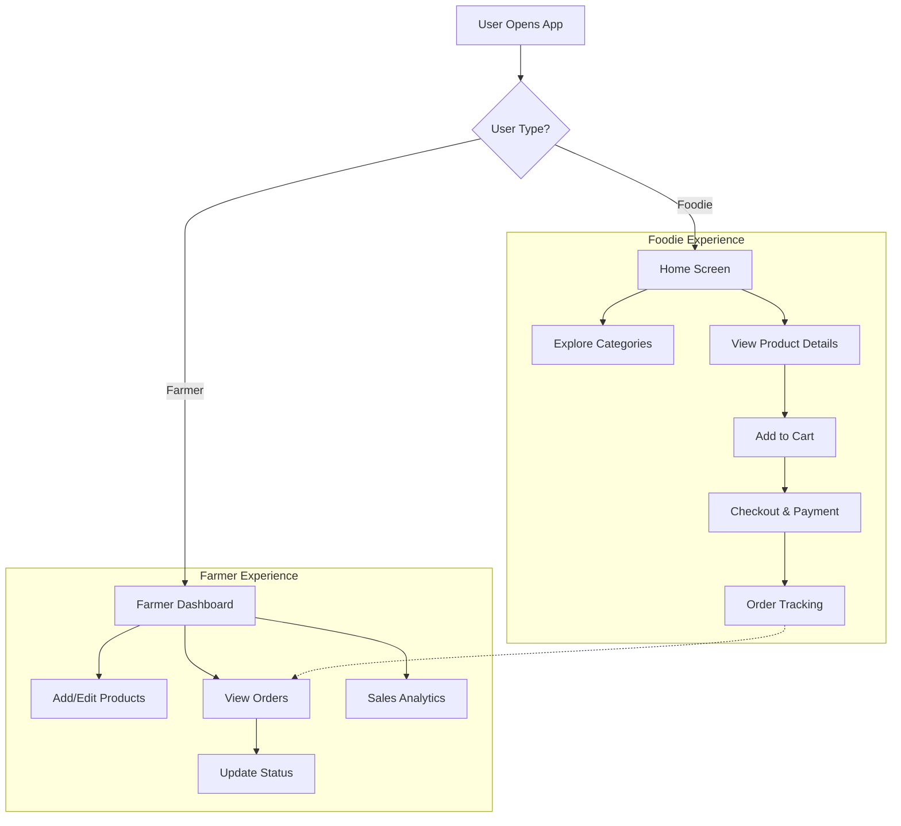
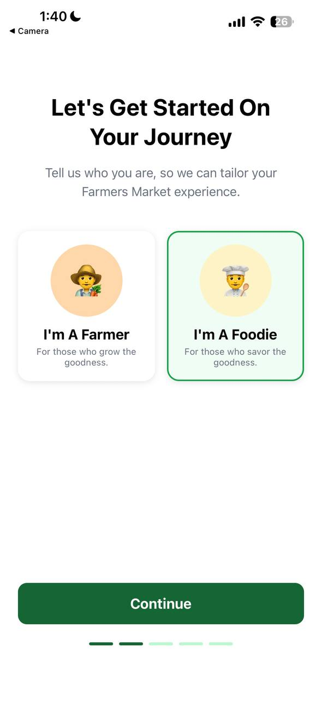
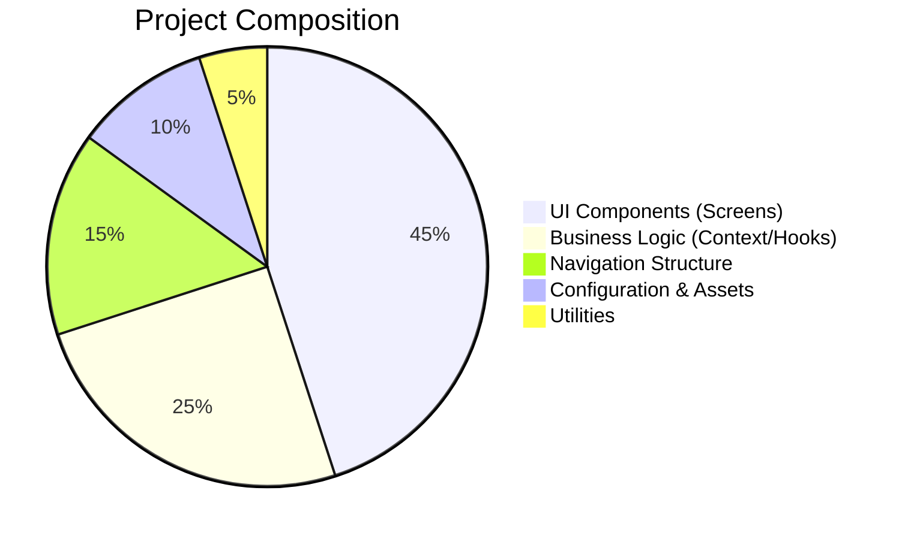

# Foodle 🥬
### The Modern Farm-to-Table Marketplace


**Foodle** is a premium mobile application designed to bridge the gap between local farmers and health-conscious consumers. By eliminating middlemen, Foodle ensures farmers get fair prices while consumers enjoy fresh, organic produce delivered directly to their doorstep.

---

## 📱 App Overview

Foodle features a dual-interface system tailored for two distinct user types:

*   **Foodies (Consumers)**: Browse fresh produce, manage cart, track orders, and discover local farmers.
*   **Farmers (Sellers)**: Manage inventory, track sales analytics, process orders, and build their brand.

### 📊 User Flow Architecture



### 📸 App Screenshots

<p align="center">
  
  
  
</p>
<p align="center">
  
  
  
</p>

---

## 🚀 Key Features

### For Foodies 🛒
*   **Smart Search & Filter**: Find products by category, price, or farmer rating.
*   **Real-time Cart**: Persistent cart management with dynamic total calculation.
*   **Favorites**: Save top-rated products and farmers for quick access.
*   **Order History**: Track past purchases and re-order with one tap.

### For Farmers 👨‍🌾
*   **Inventory Management**: Easy-to-use interface for adding and updating produce.
*   **Order Management**: Accept, process, and mark orders as delivered.
*   **Performance Metrics**: Visual insights into daily sales and popular items.
*   **Profile Customization**: Showcase farm details and build trust with customers.

---

## 🛠️ Technology Stack

Foodle is built with a robust, modern tech stack ensuring performance and scalability.

| Category | Technology | Usage |
|----------|------------|-------|
| **Core** | React Native (Expo) | Cross-platform mobile development |
| **Language** | TypeScript | Type-safe code and better developer experience |
| **Styling** | NativeWind (Tailwind) | Utility-first styling for rapid UI development |
| **Navigation** | React Navigation | Native stack and bottom tab navigation |
| **State** | React Context API | Global state for User, Cart, and Toast notifications |
| **Icons** | Lucide React Native | Modern, consistent icon set |

### 📈 Code Composition



---

## 📂 Project Structure

```bash
foodle/
├── app.json             # Expo configuration
├── App.tsx              # Entry point & Provider wrapping
├── babel.config.js      # Babel setup for NativeWind
├── components/          # Reusable UI components (Sidebar, etc.)
├── context/             # Global state (Cart, User, Toast)
├── navigation/          # Stack and Tab navigators
├── screens/             # Application screens
│   ├── HomeScreen.tsx
│   ├── FarmerHomeScreen.tsx
│   ├── ProductDetailScreen.tsx
│   ├── CartScreen.tsx
│   └── ...
├── utils/               # Helper functions (responsive scaling)
└── assets/              # Images and icons
```

---

## 🏁 Getting Started

1.  **Clone the repository**
    ```bash
    git clone https://github.com/eres45/foodle.git
    cd foodle
    ```

2.  **Install Dependencies**
    ```bash
    npm install
    ```

3.  **Start the App**
    ```bash
    npx expo start
    ```

4.  **Run on Device**
    *   Scan the QR code with the **Expo Go** app (Android/iOS).
    *   Press `a` for Android Emulator or `i` for iOS Simulator.

---

## 🤝 Contributing

Contributions are welcome! Please fork the repository and submit a pull request for any enhancements.

1.  Fork the Project
2.  Create your Feature Branch (`git checkout -b feature/AmazingFeature`)
3.  Commit your Changes (`git commit -m 'Add some AmazingFeature'`)
4.  Push to the Branch (`git push origin feature/AmazingFeature`)
5.  Open a Pull Request

---

## 📄 License

Distributed under the MIT License. See `LICENSE` for more information.

---

*Built with ❤️ by the Foodle Team*
